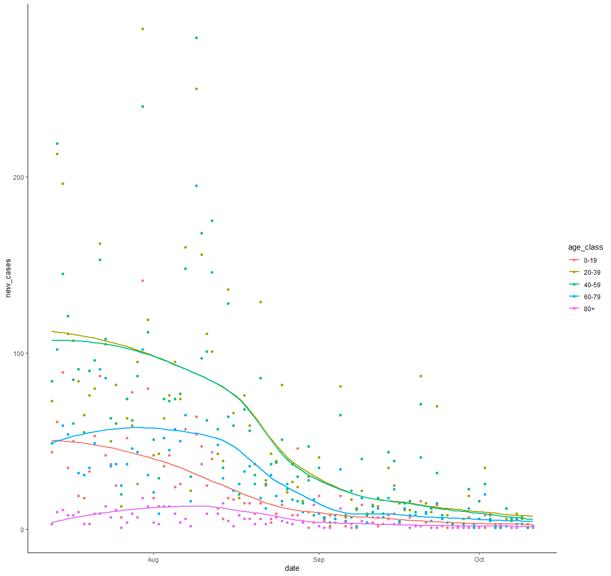
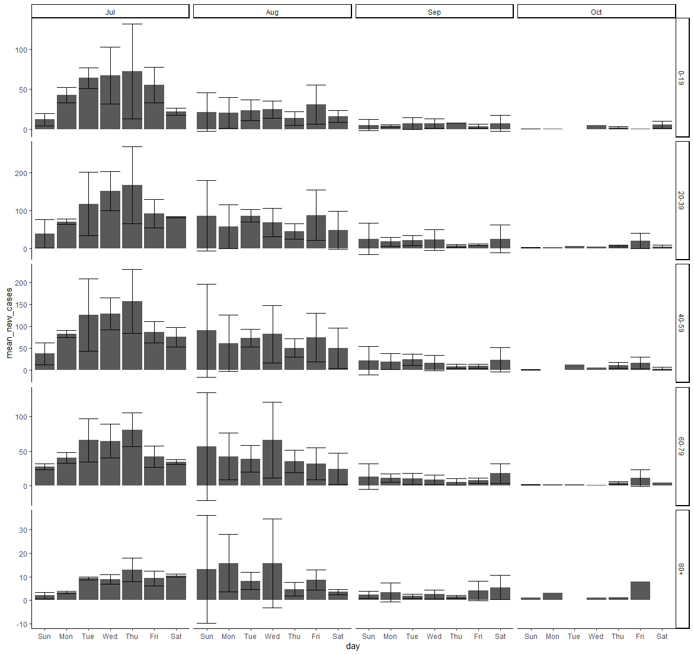
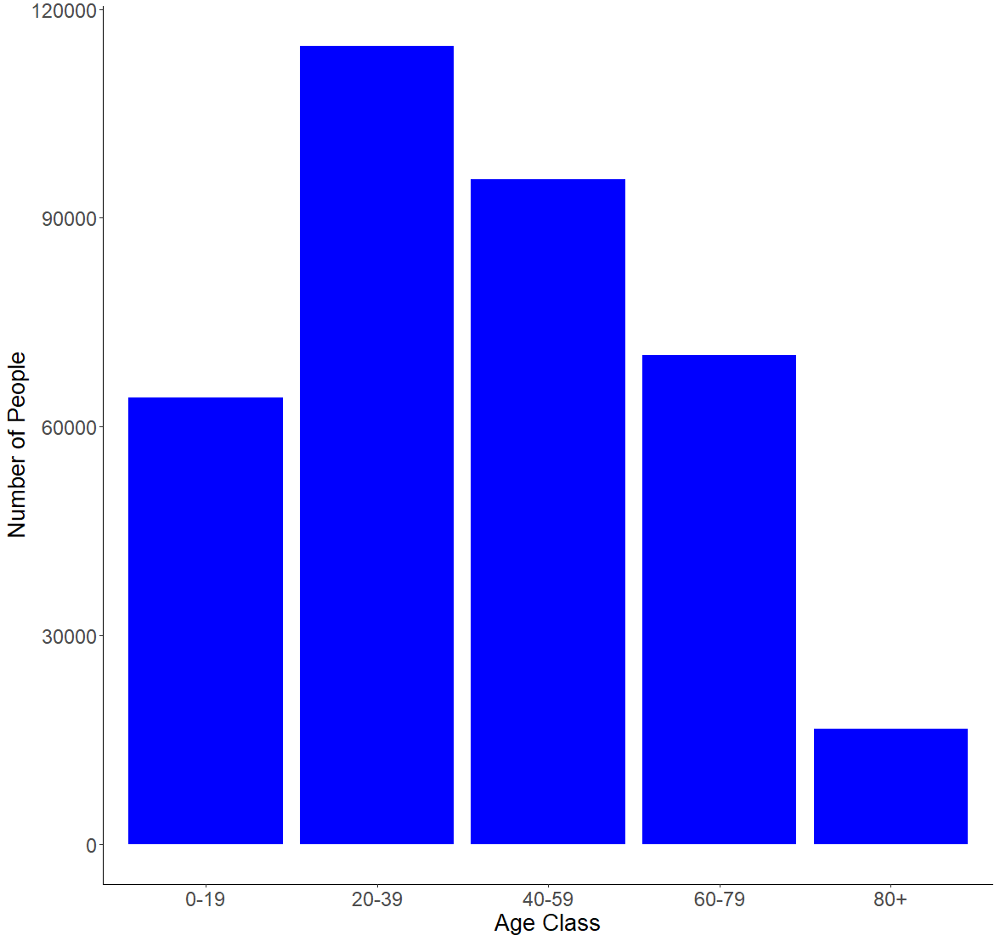
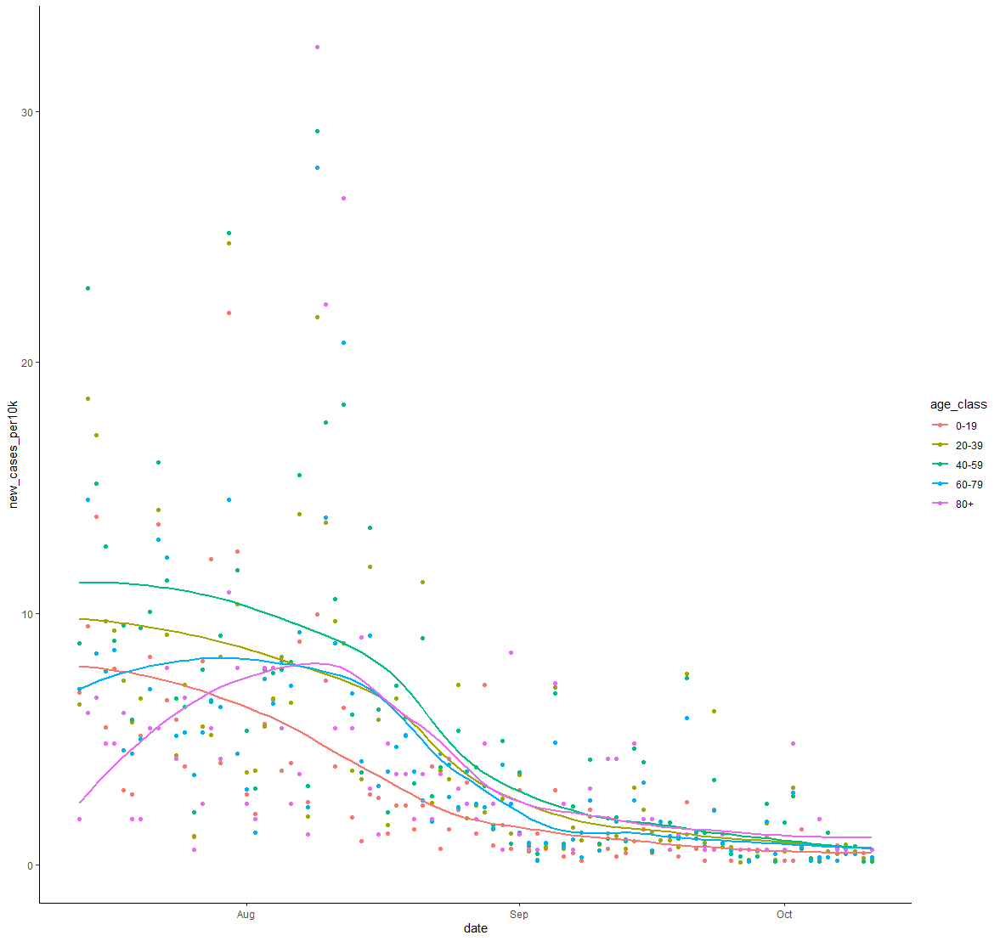

# Problems solved with R and Python
### A collection of problems I used R and Python to solve from my computational biology class.
<details><summary>R PROBLEMS</summary>
<p>

* **Problem 1** 8.23.3 from *Computing Skills for Biologists: A Toolbox* In this excersize, we will get a glimpse of the image processing capabilities of R. We want to determine the projected leaf area of plants using photos, and analyze whether the leaves have grown significantly over the course of two days. The directory CSB/r/data/leafarea/ contains images of plants at two time points (t1 and t2). The data have been collected by Madlen.
  * a.) Write a for loop that processes all images using the function getArea, which is provided in CSB/r/solutions/getArea.R. The function accepts a single file name as an argument, and returns the projected leaf area, measured in pixels. Your loop should record the leaf area for each image and store it in the data frame results. To loop over all files, you can use the function list.files along with its pattern matching option, to produce a list of all the files with extension .jpg in the directory SC/r/data/leafarea/. Work in your sandbox or change paths in the getArea.R function accordingly.
  * b.) Plot the area of each plant as measured ar the time point 1 verses time point 2.
  * c.) Determine whether the plants significantly differ at the time points 1 and 2 using a paired t-test.
  * [My Solution/Code](Assignments/assignment-06-Csaenz10-answers.R)

* **Problem 2** We will be analyzing the `age_count_2020-07-13_2020-10-11.xlsx` data se. This data consists of the date that a COVID-19 test from somebody residing in Nueces County comes back positive (LABDATE) the age of the person (AGE_YEARS). Each row is a person.  There are 4 worksheets in the excel workbook, one per month from July to October. Your goal is to complete the tasks and create an R script that will work when this repo is cloned to any computer. I encourage you to make tidyverse pipelines, where the responses from several questions are assembled in one or a few pipelines. When you are complete, submit by pushing the changes to github.
  * a.) Create an R script named `ageCovidSummary.R` in your exam repo and set the working directory with the following command:

```r 
setwd(dirname(rstudioapi::getActiveDocumentContext()$path))
```

  * b.) Load the following libraries (and install if necessary): tidyverse, readxl, janitor,lubridate
  * c.) Referring to lecture 8, read the data from `age_count_2020-07-13_2020-10-11.xlsx` into a tibble named `covid_cases_age` and then do the following in a single pipeline:

  * format the column names
  
  * make a new column called `date` and format it as YYYY-MM-DD using `ymd()`
  
  * make a new column called `age_class` that evaluates the the values in `age_years` and assigns them to the proper 20 yr age bin:
  
    * 0-19, 20-39, 40-59, 60-79, 80+
  
    * use `case_when()` for this
  
  * group the tibble by `date` and `age_class`
  
  * use `summarise()` to transform the tibble so that each row is a unique combination of `date` and `age_class`, and the number of positive cases in each age class on each date is stored in a column called `new_cases`
  
    * If done properly, this is how `covid_cases_age` will look:
  
    ```r
    > covid_cases_age
    # A tibble: 433 x 3
    # Groups:   date [91]
       date       age_class new_cases
       <date>     <chr>         <int>
     1 2020-07-13 0-19             44
     2 2020-07-13 20-39            73
     3 2020-07-13 40-59            84
     4 2020-07-13 60-79            49
     5 2020-07-13 80+               3
     6 2020-07-14 0-19             61
     7 2020-07-14 20-39           213
     8 2020-07-14 40-59           219
     9 2020-07-14 60-79           102
    10 2020-07-14 80+              10
    # ... with 423 more rows
    ```
  * d.) Create the following plot from `covid_cases_age`



  * e.) Recreate the following plot from `covid_cases_age`.  Hints: 
  
  * refer to lecture 8 where we used functions to add day of week and month to a tibble
  
  * refer to text book or search web for solution to making error bars, you will need to calculate the mean and sd for each row before initiating the plot
  
  * search the web for solution to allowing y axes to freely vary depending upon age class
  
  * the [R Graphics Cookbook](http://www.cookbook-r.com/Graphs/) could be useful here



  * f.) There are different numbers of people in the age brackets and thus we might expect more positive cases in some age brackets than others.  Read in the `Texas_Age_Demographic_Data.csv` file and process it down to a tibble named `nueces_demographics` with just the total number of people in each 20 year age bracket in Nueces county using tidyverse commands. The tibble should have 5 rows and 2 columns.  Name the columns `age_class` and `num_people` as follows:

```r 
> nueces_demographics
# A tibble: 5 x 2
  age_class num_people
  <chr>          <dbl>
1 0-19           64181
2 20-39         114717
3 40-59          95495
4 60-79          70266
5 80+            16584
```

  * g.) Recreate the following plot with the data in the `nueces_demographics` tibble.  The font size of the axis titles is 20 and the font size of the axis values is 18.  Hint: the [R Graphics Cookbook](http://www.cookbook-r.com/Graphs/) could be useful here.



  * h.) Now we can use the demographic data to calculate the number of new cases relative to the number of people in each age class. Join `covid_cases_age` and `nueces_demographics` together and save the new tibble as `covid_cases_age_census`. Add a column named `new_cases_per10k` with values calculated as follows: `10000*new_cases/num_people`.  The result will be a tibble like `covid_cases_age` but with 2 additional columns :

```r 
> covid_cases_age_census
# A tibble: 433 x 5
# Groups:   date [91]
   date       age_class new_cases num_people new_cases_per10k
   <date>     <chr>         <int>      <dbl>            <dbl>
 1 2020-07-13 0-19             44      64181             6.86
 2 2020-07-13 20-39            73     114717             6.36
 3 2020-07-13 40-59            84      95495             8.80
 4 2020-07-13 60-79            49      70266             6.97
 5 2020-07-13 80+               3      16584             1.81
 6 2020-07-14 0-19             61      64181             9.50
 7 2020-07-14 20-39           213     114717            18.6 
 8 2020-07-14 40-59           219      95495            22.9 
 9 2020-07-14 60-79           102      70266            14.5 
10 2020-07-14 80+              10      16584             6.03
# ... with 423 more rows
```

  i.) I have noticed a pattern where the elderly are the last age group to experience a spike in COVID cases after a local outbreak.  Modify your code from question 3 above to make a plot with `new_cases_per10k` on the y axis.  Is the figure consistent with my observations from other time periods? Which figure, this one or the one from question 3 better portrays the level of COVID infection within and among age classes?  Why?



* [My Solution/Code](Assignments/ageCovidSummary.R)


</p>
</details>


<details><summary>PYTHON PROBLEMS</summary>
<p>

* **Problem 1** 3.8.1 from *Computing Skills for Biologists: A Toolbox*
Description
* **Problem 2** 3.8.2 from *Computing Skills for Biologists: A Toolbox*
Description
* [My Solution/Code](Assignments/assignment-11-Csaenz10.txt)

* **Problem 3** 4.10.1 from *Computing Skills for Biologists: A Toolbox*
* [My Solution/Code](Assignments/assignment12.txt)


</p>
</details>

