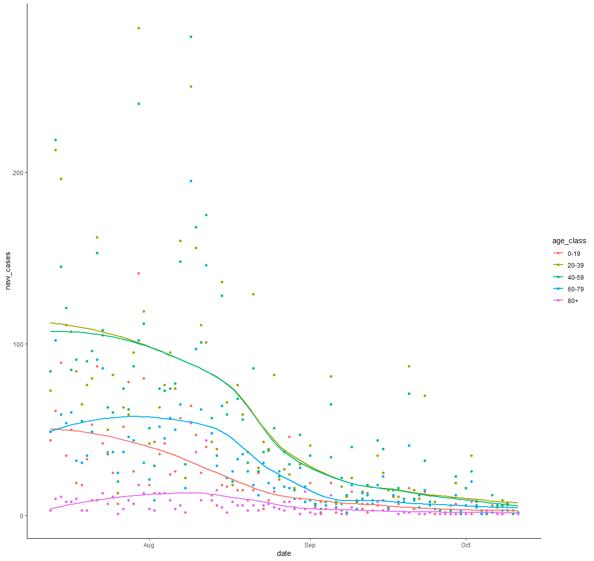
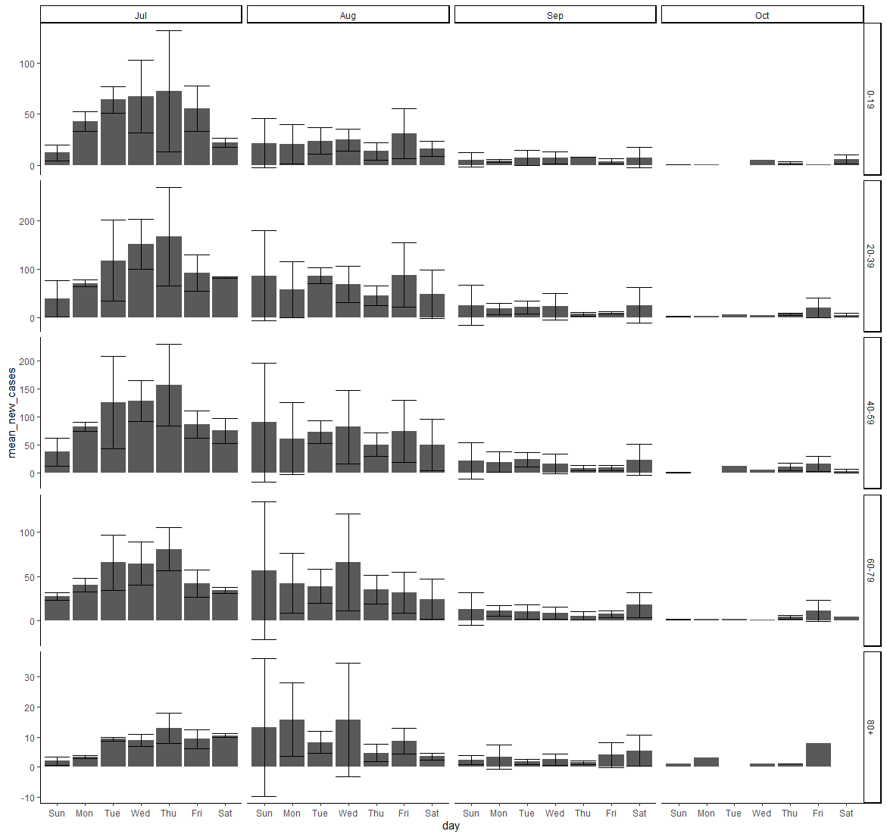
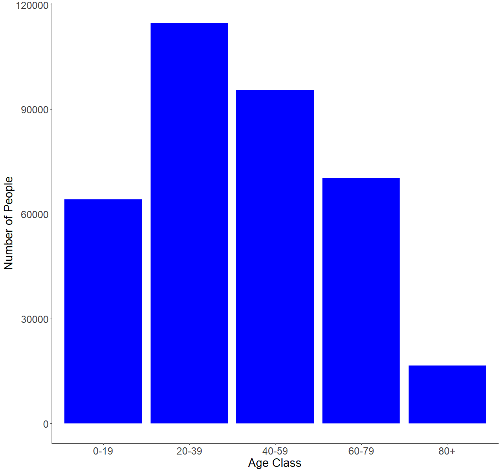
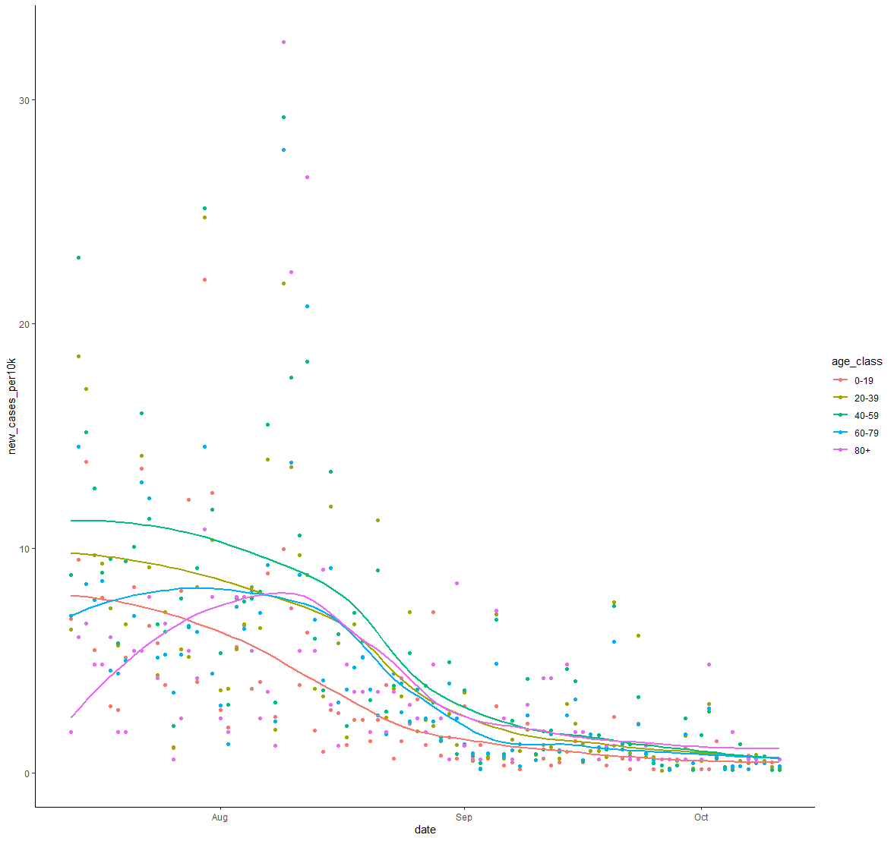

# Problems solved using Python and R.
### A collection of problems that we were required to use Python or R to solve from my Computation for 21st Century Biologists class taken this past Fall 2020 semester.
<details><summary>R PROBLEMS</summary>
<p>

**Problem 1** 8.23.3 from *Computing Skills for Biologists: A Toolbox*; In this excersize, we will get a glimpse of the image processing capabilities of R. We want to determine the projected leaf area of plants using photos, and analyze whether the leaves have grown significantly over the course of two days. The directory CSB/r/data/leafarea/ contains images of plants at two time points (t1 and t2). The data have been collected by Madlen.
  * Write a for loop that processes all images using the function `getArea`, which is provided in CSB/r/solutions/getArea.R. The function accepts a single file name as an argument, and returns the projected leaf area, measured in pixels. Your loop should record the leaf area for each image and store it in the data frame results. To loop over all files, you can use the function `list.files` along with its pattern matching option, to produce a list of all the files with extension .jpg in the directory SC/r/data/leafarea/. Work in your sandbox or change paths in the `getArea.R` function accordingly.
  * Plot the area of each plant as measured at the time point 1 verses time point 2.
  * Determine whether the plants significantly differ at the time points 1 and 2 using a paired t-test.
  
 [My Solution/Code](Assignments/assignment-06-Csaenz10-answers.R)

**Problem 2** We will be analyzing the `age_count_2020-07-13_2020-10-11.xlsx` data set; This data consists of the date that a COVID-19 test from somebody residing in Nueces County comes back positive (LABDATE) and the age of the person (AGE_YEARS). Each row is a person. There are 4 worksheets in the excel workbook, one per month from July to October. Your goal is to complete the tasks and create an R script that will work when this repo is cloned to any computer. I encourage you to make tidyverse pipelines, where the responses from several questions are assembled in one or a few pipelines.
  * Create an R script named `ageCovidSummary.R` in your exam repo and set the working directory with the following command: 

```r
setwd(dirname(rstudioapi::getActiveDocumentContext()$path))
```


* Load the following libraries (install if necessary): tidyverse, readxl, janitor, and lubridate
* Read the data from `age_count_2020-07-13_2020-10-11.xlsx` into a tibble named `covid_cases_age` and then do the following in a single pipeline:
    * format the column names
    * make a new column called `date` and format it as YYYY-MM-DD using `ymd()`
    * make a new column called `age_class` that evaluates the the values in `age_years` and assigns them to the proper 20 yr age bin: 0-19, 20-39, 40-59, 60-79, 80+
      * use `case_when()` for this
    * group the tibble by `date` and `age_class`
    * use `summarise()` to transform the tibble so that each row is a unique combination of `date` and `age_class`, and the number of positive cases in each age class on each date is stored in a column called `new_cases`
    * If done properly, this is how `covid_cases_age` will look:
    
    ```r
     > covid_cases_age
    # A tibble: 433 x 3
    # Groups:   date [91]
       date       age_class new_cases
       <date>     <chr>         <int>
     1 2020-07-13 0-19             44
     2 2020-07-13 20-39            73
     3 2020-07-13 40-59            84
     4 2020-07-13 60-79            49
     5 2020-07-13 80+               3
     6 2020-07-14 0-19             61
     7 2020-07-14 20-39           213
     8 2020-07-14 40-59           219
     9 2020-07-14 60-79           102
    10 2020-07-14 80+              10
    # ... with 423 more rows
    ```
    
  
* Create the following plot from `covid_cases_age`
  



  
* Recreate the following plot from `covid_cases_age`.
* Hints: 
  * refer to lecture 8 where we used functions to add day of week and month to a tibble
  * refer to textbook/web for solution to making error bars, you will need to calculate the mean and sd for each row before initiating the plot
  * search the web for solution to allowing y axes to freely vary depending upon age class
  * the [R Graphics Cookbook](http://www.cookbook-r.com/Graphs/) could be useful here



* There are different numbers of people in the age brackets and thus we might expect more positive cases in some age brackets than others. Read in the `Texas_Age_Demographic_Data.csv` file and process it down to a tibble named `nueces_demographics` with just the total number of people in each 20 year age bracket in Nueces county using tidyverse commands. The tibble should have 5 rows and 2 columns.  Name the columns `age_class` and `num_people` as follows:

```r 
> nueces_demographics
# A tibble: 5 x 2
  age_class num_people
  <chr>          <dbl>
1 0-19           64181
2 20-39         114717
3 40-59          95495
4 60-79          70266
5 80+            16584
```

* Recreate the following plot with the data in the `nueces_demographics` tibble. The font size of the axis titles is 20 and the font size of the axis values is 18.



* Now we can use the demographic data to calculate the number of new cases relative to the number of people in each age class. Join `covid_cases_age` and `nueces_demographics` together and save the new tibble as `covid_cases_age_census`. Add a column named `new_cases_per10k` with values calculated as follows: `10000*new_cases/num_people`.  The result will be a tibble like `covid_cases_age` but with 2 additional columns :

```r 
> covid_cases_age_census
# A tibble: 433 x 5
# Groups:   date [91]
   date       age_class new_cases num_people new_cases_per10k
   <date>     <chr>         <int>      <dbl>            <dbl>
 1 2020-07-13 0-19             44      64181             6.86
 2 2020-07-13 20-39            73     114717             6.36
 3 2020-07-13 40-59            84      95495             8.80
 4 2020-07-13 60-79            49      70266             6.97
 5 2020-07-13 80+               3      16584             1.81
 6 2020-07-14 0-19             61      64181             9.50
 7 2020-07-14 20-39           213     114717            18.6 
 8 2020-07-14 40-59           219      95495            22.9 
 9 2020-07-14 60-79           102      70266            14.5 
10 2020-07-14 80+              10      16584             6.03
# ... with 423 more rows
```


* I have noticed a pattern where the elderly are the last age group to experience a spike in COVID cases after a local outbreak. Modify your code from question 3 above to make a plot with `new_cases_per10k` on the y axis. Is the figure consistent with my observations from other time periods? Which figure, this one or the one from question 3 better portrays the level of COVID infection within and among age classes? Why?



[My Solution/Code](Assignments/ageCovidSummary.R)

**Problem 3** DNA Barcoding; You will perform DNA barcoding on the samples collected during the [2019 Texas Bioblitz](http://www.tamucc.edu/news/2019/08/082819-tamucc-collaborates-with-smithsonian-utmsi-on-marine-bioblitz.html#.XWmdQihKhaR). This will involve downloading the command line BLAST software package which is used to search GenBank, running BLAST searches from the `bash` command line, and making graphs of the output using `R`.

* Installing BLAST; If you are using `Ubuntu`, follow these instructions:

```bash
# download the prcompiled unix binary which is in a compressed tarball 
wget ftp://ftp.ncbi.nlm.nih.gov/blast/executables/blast+/2.8.1/ncbi-blast-2.8.1+-x64-linux.tar.gz

# decompress the tarball 
tar -zxvpf ncbi-blast-2.8.1+-x64-linux.tar.gz

```


* You should now have a directory called `ncbi-blast-2.8.1+` and the BLAST software tools are located in `ncbi-blast-2.8.1+/bin` You can move the BLAST tools into a directory in your PATH such as `/usr/local/bin` so that you can access blast from any directory. Confirm that `blastn` will run by checking the version and viewing the manual.

```bash
sudo cp ncbi-blast-2.8.1+/bin/* /usr/local/bin
source ~/.bashrc
```


* Run a couple BLAST searches using the nucleotide database search tool called `blastn`. The following sequence was collected from a fish during the [2019 Texas Bioblitz](http://www.tamucc.edu/news/2019/08/082819-tamucc-collaborates-with-smithsonian-utmsi-on-marine-bioblitz.html#.XWmdQihKhaR). The goal of this effort was to document the diversity of marine life in the Coastal Bend of Texas and create taxonomic-expert-verified DNA barcodes to improve public databases.

```bash
blastn -db nt -query 2019-USATXS-0202_Chasmoides-logimaxilla_Fish_F1_2019-11-19_C02.1.fasta -out results.out -remote
```


The results should look like this if you use `less -S` to view the `results.out` file

```bash
BLASTN 2.8.1+


Reference: Zheng Zhang, Scott Schwartz, Lukas Wagner, and Webb
Miller (2000), "A greedy algorithm for aligning DNA sequences", J
Comput Biol 2000; 7(1-2):203-14.


Database: Nucleotide collection (nt)
           55,311,125 sequences; 252,862,725,426 total letters


Query= 2019_USATXS_0202_Chasmoides-logimaxilla_Fish_F1

Length=645

RID: YU2FU0A6014
                                                                      Score     E
Sequences producing significant alignments:                          (Bits)  Value

JQ842579.1  Menidia sp. BOLD:AAD7634 voucher SMSA7149 cytochrome ...  708     0.0
HQ573276.1  Menidia beryllina voucher MXIV0811 cytochrome oxidase...  708     0.0
HQ573278.1  Menidia beryllina voucher MXIV0813 cytochrome oxidase...  702     0.0
HQ573275.1  Menidia beryllina voucher MXIV0810 cytochrome oxidase...  702     0.0
KF930119.1  Menidia beryllina voucher KUT 1639 cytochrome oxidase...  697     0.0
JQ842578.1  Menidia sp. BOLD:AAD7634 voucher SMSA7147 cytochrome ...  693     0.0
JQ842577.1  Menidia sp. BOLD:AAD7634 voucher SMSA7148 cytochrome ...  693     0.0
HQ573333.1  Menidia beryllina voucher MXIV0701 cytochrome oxidase...  675     0.0
HQ573332.1  Menidia beryllina voucher MXIV0700 cytochrome oxidase...  675     0.0
HQ573334.1  Menidia beryllina voucher MXIV0702 cytochrome oxidase...  669     0.0
HQ564609.1  Menidia colei voucher NEC-0221 cytochrome oxidase sub...  669     0.0
KX688296.1  Menidia beryllina isolate LS01 cytochrome c oxidase s...  664     0.0
HQ573335.1  Menidia beryllina voucher MXIV0703 cytochrome oxidase...  664     0.0
KJ921739.1  Chirostoma humboldtianum mitochondrion, complete genome   652     0.0
EU751747.1  Chirostoma riojai voucher IPN 035 cytochrome oxidase ...  636     4e-178
EU751737.1  Chirostoma jordani voucher IPN 026 cytochrome oxidase...  636     4e-178
EU751735.1  Chirostoma jordani voucher IPN 028 cytochrome oxidase...  636     4e-178
EU751749.1  Chirostoma riojai voucher IPN 033 cytochrome oxidase ...  630     2e-176
EU751748.1  Chirostoma riojai voucher IPN 034 cytochrome oxidase ...  630     2e-176
EU751742.1  Chirostoma jordani voucher IPN 008 cytochrome oxidase...  630     2e-176
EU751741.1  Chirostoma jordani voucher IPN 009 cytochrome oxidase...  630     2e-176
EU751739.1  Chirostoma jordani voucher IPN 011 cytochrome oxidase...  630     2e-176
EU751734.1  Chirostoma jordani voucher IPN 029 cytochrome oxidase...  630     2e-176
results.out
```

The output does not provide all of the information we need to determine how good the match is between our query sequence from the Bioblitz and the database sequences in GenBank, so we need to update the settings used in the BLAST search

I looked at the manual for BLAST `blastn -help` as well as the blast results from the [NCBI BLAST website](https://blast.ncbi.nlm.nih.gov/Blast.cgi?PROGRAM=blastn&PAGE_TYPE=BlastSearch&LINK_LOC=blasthome) and the [online BLAST help](https://www.ncbi.nlm.nih.gov/books/NBK279682/) to determine which settings I wanted to use to add columns of information to the output

```bash
blastn -db nt -query 2019-USATXS-0202_Chasmoides-logimaxilla_Fish_F1_2019-11-19_C02.1.fasta -outfmt "7 qseqid stitle saccver qcovs pident evalue qseq" -max_target_seqs 50 -out results.out -remote
```


Note that in the output, the line labeled "Fields" contains the column headers:

* query id	-	sample name from the fasta file
* subject title	-	Title of database record matching the query sequence from the bioblitz
* subject acc.ver	-	GenBank accession number of the record matching the query
* % query coverage per subject	-	percent of query sequence that can be aligned to the database record
* % identity	-	percent of aligned nucleotides that match (97% is typically considered a species match by default)
* evalue	-	"The Expect value (E) is a parameter that describes the number of hits one can "expect" to see by chance when searching a database of a particular size. It decreases exponentially as the Score (S) of the match increases. Essentially, the E value describes the random background noise. For example, an E value of 1 assigned to a hit can be interpreted as meaning that in a database of the current size one might expect to see 1 match with a similar score simply by chance."
* query seq	-	sequence of the database record aligned to the query sequence

Now let us search on multiple sequences.  

If you have not done so already concatenate the two fasta files in a new file called `two_seqs.fasta`

* `2019-USATXS-0703_Gobiidae-sp_Fish_R1_2019-11-12_H06.1.fasta`
* `2019-USATXS-0202_Chasmoides-logimaxilla_Fish_F1_2019-11-19_C02.1.fasta`

Then revise the blastn search to query `two_seqs.fasta`, change the max number of sequences returned to be 20, and save the blast results into a file called `results_twoseqs.out`

* Using R to Visualize Output from Blast. It would take too long for you to blast all of the sequences we generated in the Bioblitz, so I did it for you. Rather than concatenating two fasta sequences together, I concatenated all of them and ran a blast search very similar to the one you just ran. The results of that blast search on 601 sequences can be found in `results_blast.out`. I used bash tools such as `grep` `cut` `paste` to convert the blast output to a file with 1 row per query sequence called `tophit.tsv`. I further manipulated `tophit.tsv` to add columns, which resulted in the final file `tophit4.tsv` which can be read into R.

The columns in `tophit4.tsv` are:
* Sample	-	bioblitz sample name
* TaxExpSpId	-	species id given to sample by taxonomic expert-verified
* GenBankSpID	-	the specied id of the most similar sequence in GenBank to our bioblitz sample sequence
* GenBankDescription	-	self explanitory
* TaxId	-	every species has a unique taxonomic id in GenBank, this is that id
* Accession	-	every sequence has a unique id in GenBank, this is that id
* PctQueryCoverage	-	percent of query sequence that can be aligned to the database record
* PctIdentity	-	percent of aligned nucleotides that match (97% is typically considered a species match by default)
* Escore	-	"The Expect value (E) is a parameter that describes the number of hits one can "expect" to see by chance when searching a database of a particular size. It decreases exponentially as the Score (S) of the match increases. Essentially, the E value describes the random background noise. For example, an E value of 1 assigned to a hit can be interpreted as meaning that in a database of the current size one might expect to see 1 match with a similar score simply by chance."
* QuerySeq	-	sequence of the database record aligned to the query sequence
* SpIdMatch	-	do TaxExpSpId and GenBankSpID match exactly?
* MatchQuality	-	categorical assessment of PctIdentity, >=97 is a SpeciesHit, as PctIdentity decreases, it becomes less likely that the species we sampled has been barcoded
* CoverageQuality	-	categorical assessment of PctQueryCoverage, if this value is too low then it means that we need a better algorithm to identify the best match
* Err_MatchQual	-	this is a combination of the aforementioned categorical columns with additional categories inidicating samples that have been mislabeled in our data sheets and need to be fixed or 


* Your task is to make an R script called `tophit4.R` to visualize the data in `tophit4.tsv`. You will need to 
  * make sure `tophit4.tsv` accessible by RStudio. If you cloned your repo to a windows-accessible directory such as `/mnt/c/Users/YOURUSERNAME/Documents/final_exam`, then you should be fine
  * set your R-studio working directory to the location of `tophit4.tsv`
    * I would create the R file in your repo, then use `setwd(dirname(rstudioapi::getActiveDocumentContext()$path))`
  * use the `tidyverse` tool called `read_tsv` to read in `tophit4.tsv`
  * use `ggplot` to recreate the following figures in the following files `Rplot.png`, `Rplot2.png`, `Rplot3.png`


[My Solution/Code](Assignments/tophit4.R)


</p>
</details>


<details><summary>PYTHON PROBLEMS</summary>
<p>

**Problem 1** 3.8.1 Measles Time Series from *Computing Skills for Biologists: A Toolbox*; In their article, Dalziel et al. (2016) provide a long time series reporting the number of cases of measles before mass vacination, for many US cities. The data consist of cases in a given US city for a given year, and a given biweek of the year (i.e., first two weeks, second two weeks, etc.). The time series is contained in the file `Dalziel2016_data.csv`.
  * Write a program that extracts the names of all the cities in the database (one entry per city).
  * Write a program that creates a dictionary where the keys are the cities and the values are the number of records (rows) for that city in the data.
  * Write a program that calculates the mean population for each city obtained by averaging the values of `pop`.
  * Write a program that calculates the mean population for each city and year.
**Problem 2** 3.8.2  Red Queen in Fruit Flies from *Computing Skills for Biologists: A Toolbox*; Singh et al. (2015) show that, when infected with a parasite, the four genetic lines of *D. melanogaster* respond by increasing the production of recombinant offspring (arguably, trying to produce new recombinants able to escape the parasite). They show that the same outcome is not achieved by artificially wounding the flies. The data needed to replicate the main claim (figure 2 of the original article) is contained in the file `Singh2015_data.csv`. Open the file, and compute the mean `RecombinantFraction` for each `*Drosophilia* Line`, and `InfectionStatus` (W for wounded and I for infected). Print the results in the following form:

```bash
Line 45 Average Recombination Rate:
W : 0.187
I : 0.191
```

[My Solution/Code](Assignments/assignment-11-Csaenz10.txt)

**Problem 2** 4.10.1 Assortative Mating in Animals from *Computing Skills for Biologists: A Toolbox*; Jiang et al. (2013) studied the assortative mating in animals. They compiled a large database, reporting the results of many experiments on mating. In particular, for several taxa they provide the value of correlation among the sizes of the mates. A positive value of r stands for assortative mating (large animals tend to mate with large animals), and a negative value for disassortative mating.
  * You can find the data in `good_code/data/Jiang2013_data.csv`. Write a function that takes as input the desired Taxon and returns the mean value of r.
  * You should see that fish have a positive value of r, but that this is also true for other taxa. Is the mean value of r especially high for fish? To test this, compute a *p-value* by repeatedly sampling 37 values of r(37 experiments on fish are reported in the database) at random, and calculating the probability of observing a higher mean value of r. To get an accurate estimate of the *p-value*, use 50,000 randomizations.
  * Repeat the procedure for all taxa.

[My Solution/Code](Assignments/assignment12.txt)


</p>
</details>

